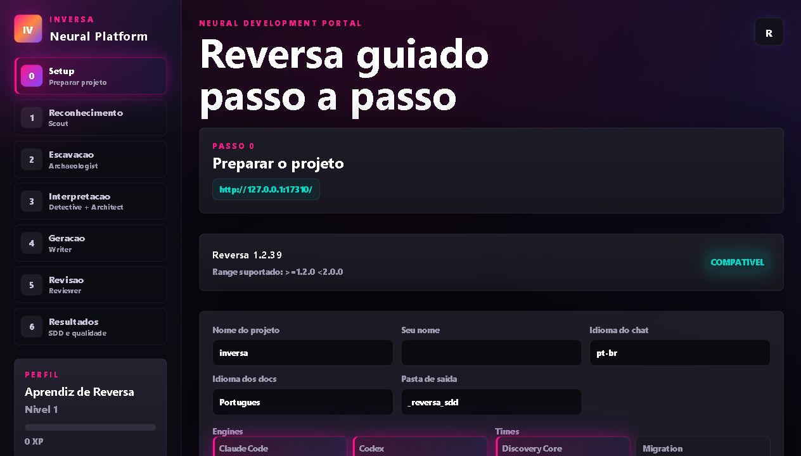
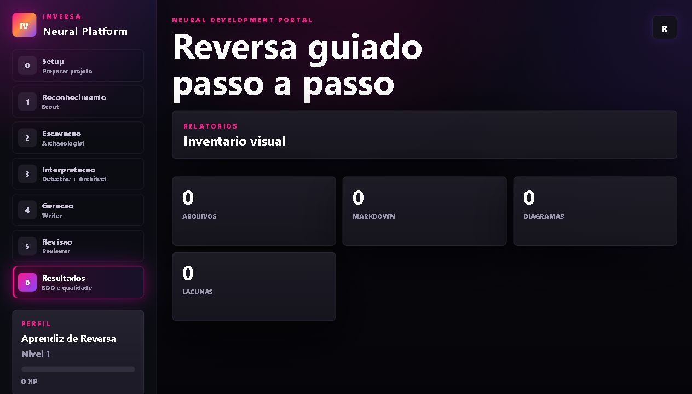

<div align="center">

  

  <br>

  <a href="https://github.com/sandeco/reversa">
    
  </a>
  <a href="https://github.com/emersoncassis/inversa">
    
  </a>
  <a href="https://physia.com.br/aieng/">
    
  </a>

</div>

# Inversa

## Manifesto

O Inversa nao nasceu para substituir o Reversa.

O Inversa e apenas uma forma mais divertida, visual e guiada de aprender a usar o Reversa.

Ele transforma a primeira experiencia com engenharia reversa assistida por IA em uma jornada de aprendizado: o usuario vira player, o projeto vira missao, cada fase vira progresso e cada artefato gerado ajuda a entender melhor como o Reversa funciona.

A missao do Inversa e reduzir a barreira de entrada para iniciantes. Ele deve ajudar o player a concluir um projeto basico, compreender o fluxo, ganhar confianca e depois seguir para o Reversa em projetos maiores, com mais autonomia.

```txt
Inversa ensina.
Reversa executa.
Inversa guia.
Reversa escala.
```

O Inversa deve ser leve, pedagogico e gamificado. Seu valor nao esta em esconder a complexidade do Reversa, mas em apresentar essa complexidade aos poucos, com contexto, feedback, progresso e incentivo constante ao aprendizado.

## Regras fundamentais

1. A estrutura do Reversa deve ser preservada, mantida intacta e atualizada em relacao ao projeto original.
2. O Inversa e para todos: iniciantes, estudantes, curiosos, profissionais em transicao e pessoas que querem aprender engenharia reversa assistida por IA de forma mais acessivel.
3. O objetivo final do Inversa e levar o player ate o Reversa. O jogo deve formar autonomia, nao dependencia. Quando o player entender o fluxo, ele deve conseguir colocar engenharia reversa em pratica diretamente com o Reversa.

O Inversa e uma interface grafica gamificada para o Reversa.

A proposta e usar o Reversa como motor tecnico de engenharia reversa assistida por agentes de IA, enquanto o Inversa cria uma experiencia visual, guiada e progressiva para incentivar aprendizagem pratica.

Em vez de tratar o usuario apenas como operador de uma CLI, o Inversa trata cada usuario como player, cada projeto como missao e cada fase concluida como progresso de aprendizado.

## Visao

```txt
Reversa = backend tecnico preservado
Inversa = frontend gamificado de aprendizagem
```

O objetivo inicial do Inversa nao e substituir o Reversa em projetos grandes. O objetivo e ajudar o player a concluir um projeto basico, entender o fluxo, ganhar confianca e depois evoluir para usar o Reversa diretamente em projetos maiores.

## Principios

- O Reversa continua sendo o motor tecnico.
- A estrutura original do Reversa deve ser preservada e acompanhada de perto.
- O Inversa adiciona jornada visual, progresso, rank e incentivo ao aprendizado.
- O Inversa deve ser acessivel para todos, independentemente do nivel inicial.
- O foco inicial e guiar o player ate concluir um projeto basico.
- A gamificacao deve ensinar boas praticas, nao apenas premiar quantidade.
- Metricas de uso, progresso e aprendizagem devem poder ser instrumentadas com OpenTelemetry.
- O player deve sair da experiencia entendendo melhor engenharia reversa, agentes e especificacoes.
- O sucesso do Inversa acontece quando o player ganha autonomia para usar o Reversa sem depender do game.

## O que e o Reversa

O Reversa e um framework de engenharia reversa de especificacoes. Ele e instalado dentro de um projeto legado e coordena agentes especializados para analisar codigo, dependencias, regras de negocio, arquitetura, telas, dados e riscos.

A saida esperada nao e apenas documentacao para leitura humana. O objetivo e produzir contratos tecnicos que agentes de IA consigam usar para evoluir um sistema com mais contexto e menor risco.

## O que o Inversa adiciona

- Painel local para acompanhar instalacao, fases e resultados.
- Fluxo guiado para iniciantes.
- Missoes para concluir um projeto basico.
- XP, nivel, rank, badges e maturidade da analise.
- Indicadores de artefatos, lacunas, diagramas e progresso.
- Eventos locais de aprendizagem em `.reversa/state.json`, preparados para evoluir para OpenTelemetry.
- Ponte pedagogica entre aprender o fluxo e usar o Reversa em modo avancado.

## Jornada do player

```txt
Comecar jornada -> Preparar laboratorio -> Reconhecer projeto -> Escavar codigo -> Interpretar regras -> Gerar specs -> Revisar lacunas -> Concluir missao basica -> Evoluir para Reversa avancado
```

As fases tecnicas continuam alinhadas ao pipeline do Reversa:

```txt
Setup -> Reconhecimento -> Escavacao -> Interpretacao -> Geracao -> Revisao -> Resultados
```

Cada passo mostra foco, agente responsavel, entradas, acoes esperadas, saidas e criterio de conclusao. A ideia e reduzir dependencia inicial do terminal e deixar claro o que precisa acontecer antes de avancar.

## Gamificacao

O Inversa registra progresso local da jornada em `.reversa/state.json`.

O estado inicial inclui:

```json
{
  "player": {
    "name": "Player",
    "xp": 0,
    "level": 1,
    "rank": "Aprendiz de Reversa",
    "badges": [],
    "completed_missions": []
  },
  "learning": {
    "mode": "basic",
    "current_mission": "basic-reversa-journey"
  },
  "telemetry": {
    "provider": "local-json",
    "events": []
  }
}
```

Eventos da jornada podem virar progresso do player:

```txt
phase_started
phase_completed
mission_completed
artefato gerado
lacuna identificada
pergunta criada
revisao realizada
diagrama exportado
erro encontrado e corrigido
```

Esses eventos alimentam:

- XP;
- nivel;
- rank;
- badges;
- maturidade da analise;
- progresso da missao;
- metricas de aprendizagem com OpenTelemetry em uma proxima etapa.

Ranks sugeridos:

```txt
Aprendiz de Reversa
Explorador de Codigo
Analista de Fluxos
Cacador de Regras
Arquiteto de Specs
Mestre de Sistemas Legados
```

## Requisitos

- Node.js 18.20.2 ou superior.
- Git recomendado antes de iniciar qualquer analise.
- Um agente compativel, como Codex, Claude Code, Cursor, Gemini CLI, Windsurf, Copilot, Aider, Cline ou Roo Code.

## Instalacao rapida

Na raiz do projeto que sera analisado:

```bash
npx inversa install
```

Por compatibilidade com o Reversa, o comando abaixo tambem continua funcionando:

```bash
npx reversa install
```

O instalador detecta engines disponiveis, pergunta quais agentes devem ser instalados, coleta informacoes basicas do projeto e cria a estrutura necessaria.

## Interface web local

Para abrir a experiencia visual local:

```bash
npx inversa web
```

Compatibilidade:

```bash
npx reversa web
```

Opcoes disponiveis:

```bash
npx inversa web --port=17310
npx inversa web --host=127.0.0.1
npx inversa web --no-open
```

### Prints da interface






## Uso com agente de IA

Depois da instalacao, abra o projeto no agente de IA compativel e execute:

```txt
/reversa
```

Em engines sem suporte a slash command, use:

```txt
reversa
```

O Reversa cria ou atualiza o estado da analise em:

```txt
.reversa/state.json
```

Se a sessao for interrompida, execute `reversa` novamente para continuar.

## Pipeline tecnico

```txt
Reconhecimento -> Escavacao -> Interpretacao -> Geracao -> Revisao
    Scout       Archaeologist   Detective       Writer   Reviewer
                                  Architect
```

| Agente | Responsabilidade |
| --- | --- |
| Reversa | Orquestra a analise e controla checkpoints |
| Scout | Mapeia estrutura, linguagens, dependencias e pontos de entrada |
| Archaeologist | Analisa modulos, fluxos, algoritmos e estruturas de dados |
| Detective | Extrai regras de negocio, excecoes e comportamentos implicitos |
| Architect | Sintetiza arquitetura, integracoes, riscos e decisoes tecnicas |
| Writer | Gera especificacoes rastreaveis e prontas para uso |
| Reviewer | Revisa lacunas, inconsistencias e pontos de validacao humana |

## Artefatos gerados

O Reversa deve escrever apenas nas pastas controladas pela ferramenta:

```txt
.reversa/
_reversa_sdd/
```

Exemplo de saida esperada:

```txt
_reversa_sdd/
|-- inventory.md
|-- dependencies.md
|-- code-analysis.md
|-- data-dictionary.md
|-- domain.md
|-- architecture.md
|-- confidence-report.md
|-- gaps.md
|-- questions.md
|-- sdd/
|-- openapi/
|-- user-stories/
|-- adrs/
|-- flowcharts/
|-- sequences/
|-- ui/
|-- database/
|-- design-system/
`-- traceability/
```

## Escala de confianca

| Marca | Significado |
| --- | --- |
| CONFIRMED | Extraido diretamente do codigo |
| INFERRED | Inferido por padroes encontrados |
| GAP | Lacuna que precisa de validacao humana |

Essa separacao evita que suposicoes sejam tratadas como fatos.

## Comandos

```bash
npx inversa install          # Instala o Inversa/Reversa no projeto atual
npx inversa web              # Abre a interface visual gamificada
npx inversa status           # Mostra o estado atual da analise
npx inversa update           # Atualiza agentes instalados
npx inversa add-agent        # Adiciona um agente
npx inversa add-engine       # Adiciona suporte a uma engine
npx inversa export-diagrams  # Exporta diagramas Mermaid
npx inversa uninstall        # Remove arquivos criados pela ferramenta
```

Os comandos `npx reversa ...` continuam disponiveis por compatibilidade.

## Engines suportadas

| Engine | Ativacao |
| --- | --- |
| Claude Code | `/reversa` |
| Codex | `reversa` |
| Cursor | `/reversa` |
| Gemini CLI | `/reversa` |
| Windsurf | `/reversa` |
| GitHub Copilot | `/reversa` |
| Aider | `reversa` |
| Cline / Roo Code | `/reversa` |

## Seguranca

Antes de usar em um projeto real:

- confirme que o projeto esta versionado no Git;
- faca commit antes da analise;
- mantenha uma copia de backup quando necessario;
- revise os artefatos gerados;
- valide tudo que estiver marcado como inferido ou lacuna.

A ferramenta deve escrever somente em `.reversa/` e `_reversa_sdd/`.

## Roadmap

| Etapa | Status |
| --- | --- |
| Definir Inversa como frontend gamificado do Reversa | Concluido |
| Manter Reversa como backend tecnico e fluxo de agentes | Concluido |
| Documentar manifesto pedagogico do Inversa | Concluido |
| Registrar regras fundamentais do projeto | Concluido |
| Criar modelo de player, XP, rank e missoes | Concluido |
| Registrar eventos locais de aprendizagem no state.json | Concluido |
| Expor progresso de missao no dashboard state | Concluido |
| Documentar fluxo CLI e interface web local | Concluido |
| Publicar prints atuais da interface no README | Concluido |
| Reorganizar menus por passos do Reversa | Concluido |
| Criar experiencia guiada com botoes e menus | Em andamento |
| Instrumentar eventos de aprendizagem com OpenTelemetry real | Planejado |
| Criar modo projeto basico guiado na interface | Planejado |
| Melhorar acessibilidade visual e responsividade | Planejado |
| Registrar aprendizados da jornada AI Engineering | Continuo |

## Links

- Backend tecnico: [sandeco/reversa](https://github.com/sandeco/reversa)
- Frontend gamificado: [emersoncassis/inversa](https://github.com/emersoncassis/inversa)
- Jornada AI Engineering: [emersoncassis/aieng](https://github.com/emersoncassis/aieng)
- Curso/livro: [Engenharia de Software e Agentes Inteligentes](https://physia.com.br/aieng/)

## Licenca

MIT. Consulte [LICENSE](LICENSE).
